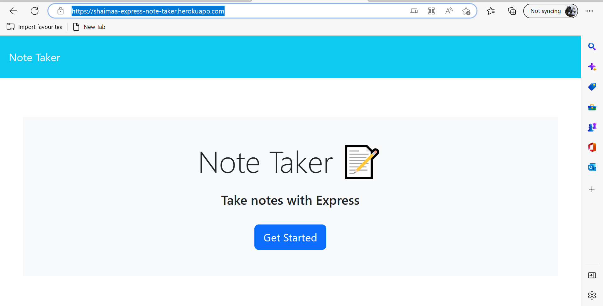
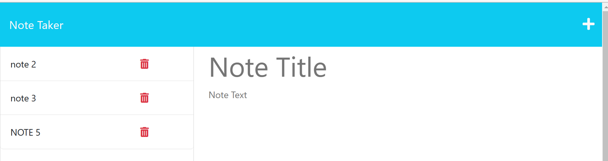
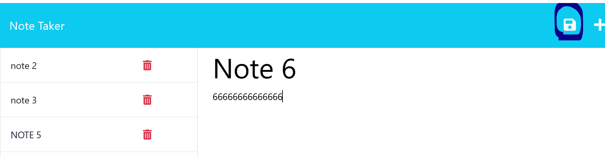

# ExpressNoteTaker

 This web appilication is to modify starter code to create an application called Note Taker that can be used to write and save notes. This application will use an Express.js back end and will save and retrieve note data from a JSON file.

  ## Table of Contents:
  * [DeployedURL](#DeployedURL)
  * [Installation](#Installation)
  * [Deployment](#Deployment)
  * [Usage](#usage)

#
## DeployedURL:
https://shaimaa-express-note-taker.herokuapp.com/

#
## Installation:
copy the code to your local machine by clone it from the GitHub
git clone "https://github.com/shaimaaGhamry/ExpressNoteTaker"

install the required libraries from the console of the visual Studio Application

npm init -y
npm install express 
npm install uuid

and then run the server using node server.js
 
Now the application is ready to be used locally, open the browser and type the localhost

#
## Deployment:
The application will be deployed on both Github repository and Heroku Server

open the command line, and type  `heroku login` to login to the heroku server using ur account

Create a new Heroku app by running the following command:
heroku create <unique-app-name>

then, go to the folder that contains the application code  and then deploy the code to both the GitHub and the Heroku Server

git add -A
git commit -m "Pushing to Heroku"
git push orgin main
git push heroku main

#
## Usage:
After installing and deploying the application, when opening the note take application url:

## https://shaimaa-express-note-taker.herokuapp.com/

THEN the user will be presented with a landing page with a link to get started a notes page

WHEN the user click on the link to get started to the notes page
THEN the user will be presented with a page with existing notes listed in the left-hand column, plus empty fields to enter a new note title and the note’s text in the right-hand column

WHEN the user enters a new note title and the note’s text
THEN a Save icon appears in the navigation at the top of the page

WHEN the user clicks on the Save icon
THEN the new note the user has entered is saved and appears in the left-hand column with the other existing notes

WHEN the user clicks on an existing note in the list in the left-hand column
THEN that note appears in the right-hand column

WHEN the user clicks on the Write icon in the navigation at the top of the page
THEN the user will be presented with empty fields to enter a new note title and the note’s text in the right-hand column